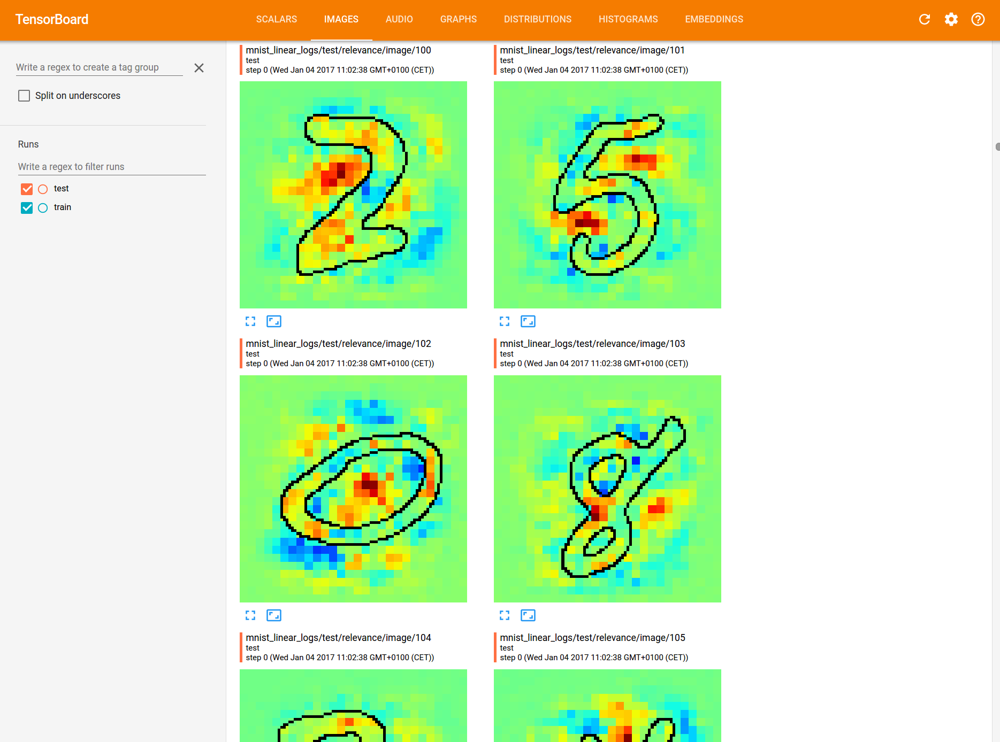
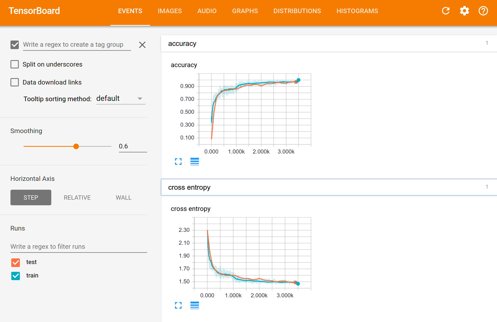
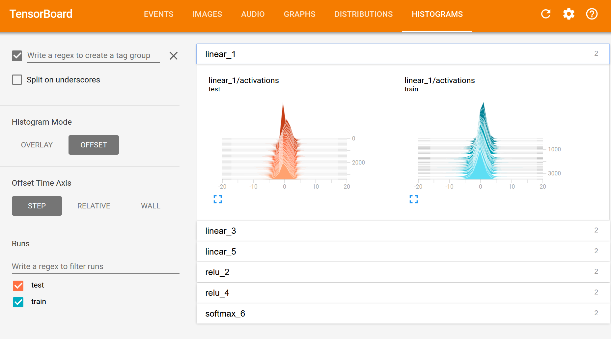

This is a tensorflow wrapper which provides simple and accessible stand-alone implementations of LRP for artificial neural networks.

### Requirements
    tensorflow >= 0.11.0rc1
    numpy == 2.7
    matplotlib >= 1.3.1
    scikit-image > 0.11.3
    
# Features

## Model 

This TF-wrapper considers the layers in the neural network to be in the form of a Sequence. A quick way to define a network would be

        net = Sequential([Linear(784,500, input_shape=(FLAGS.batch_size,784)), 
                     Relu(),
                     Linear(500, 100), 
                     Relu(),
                     Linear(100, 10), 
                     Softmax()]) 

## Train the network

This `net` can then be used to propogate and optimize using

        output = net.forward(input_data)
        
        train = net.fit(output, ground_truth, loss, optimizer)

## LRP - Layer-wise relevance propagation

And visualize the contributions of the input pixels towards the decision by

        relevance = net.lrp(output, 'simple', 1.0)

the different lrp variants available are:

        'simple','flat','w^2','epsilon' and 'alphabeta' 

# Examples - MNIST

To run the given examples 
   
        python mnist/mnist_linear.py --relevance_bool=True

It downloads and extract the mnist datset, runs it on a neural netowrk and plots the relevances once the network is optimized. The relvances of the images can be viewed using
   
        tensorboard --logdir=mnist_linear_logs

   
